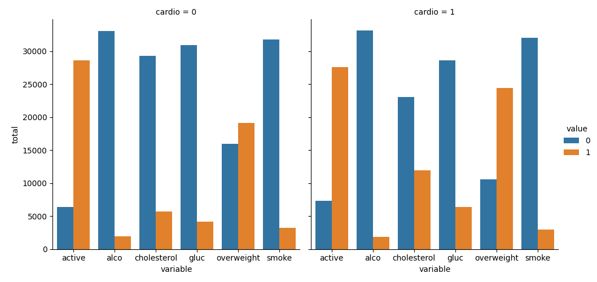
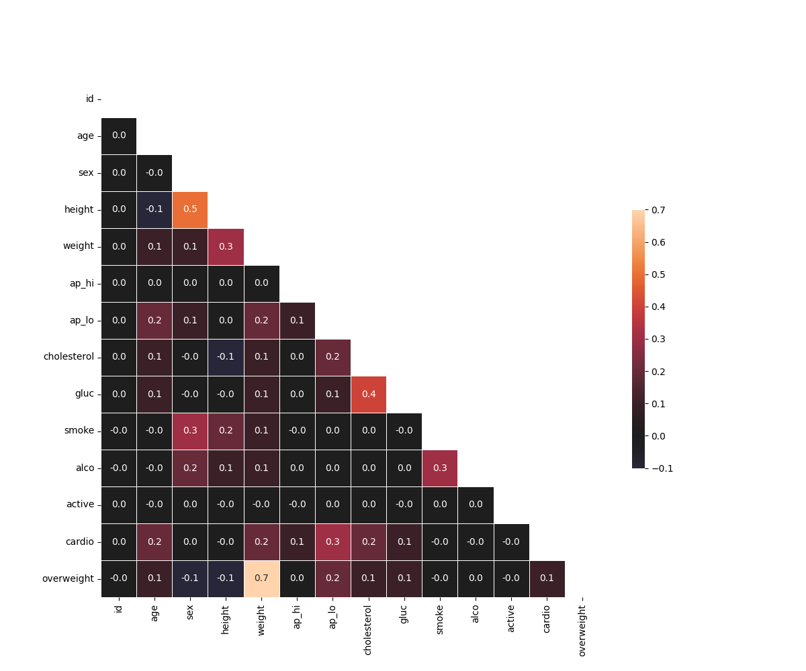

# Medical Data Visualizer  
**freeCodeCamp – Data Analysis with Python Certification**  
**Project 3 of 5**

## Project Overview
Analyzed medical examination data to visualize the relationship between **cardiovascular disease** and various health factors using **Seaborn** and **Matplotlib**.

- Created a **categorical bar plot** showing value counts split by cardio disease  
- Created a **correlation heatmap** after cleaning outliers and normalizing data  
- Fully passes all freeCodeCamp tests

## Visualizations

### 1. Categorical Features vs Cardiovascular Disease

### 2. Correlation Heatmap (Cleaned Data)

## Key Insights
- Strongest positive correlations: `age`, `cholesterol`, `weight`
- Strongest negative correlation: `active` lifestyle
- Blood pressure (`ap_hi`, `ap_lo`) shows expected strong correlation

## Live Notebook
[Run & Explore Interactively on Google Colab](https://colab.research.google.com/drive/18UYCsTBXxE3qu22ladwAY3Se7TIXMyM-?usp=sharing)

## Files Included
- `medical_data_visualizer.ipynb` – Complete code
- `medical_examination.csv` – Dataset
- `catplot.png` & `heatmap.png` – Generated plots

## Skills Demonstrated
- Feature engineering (BMI → overweight)
- Data cleaning using quantiles
- Advanced Seaborn visualization (`catplot`, `heatmap`)
- Correlation analysis
- Professional plot styling

---

## Connect with Me

**Made with love by Abishek**  
Feel free to reach out!

